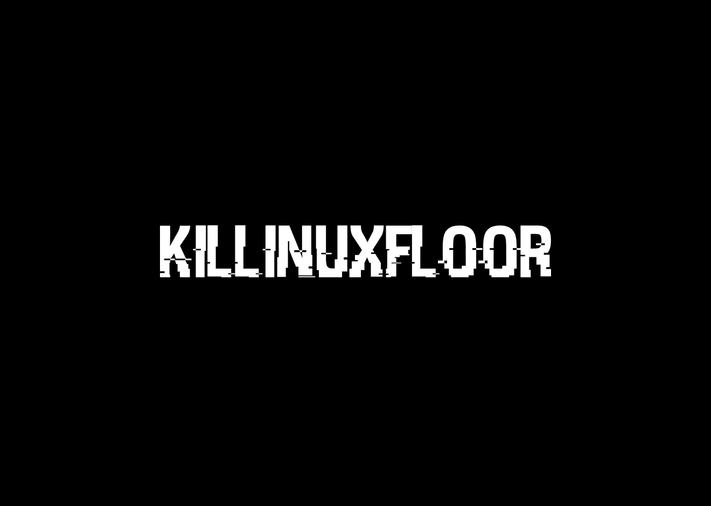
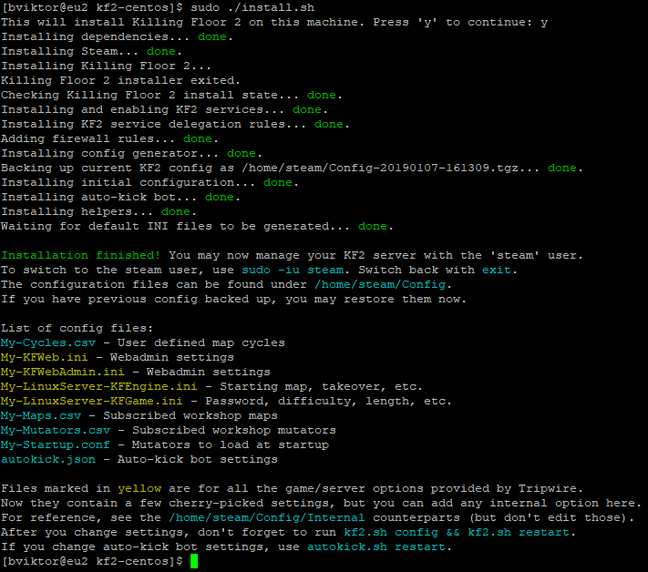
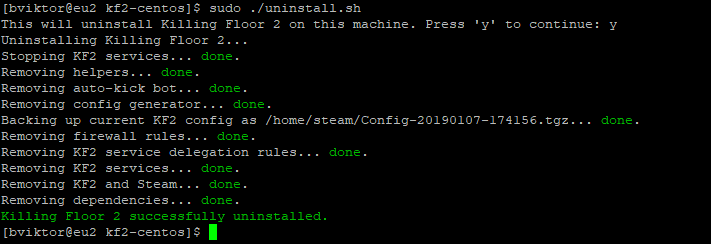

# About

Why, it's the easiest way to install and manage Killing Floor 2 on Linux. All you need is a fresh, up-to-date install of CentOS 7.

Features:

* One-command installation of the Killing Floor 2 Linux Server
* One-command uninstallation as well
* Automatic backup of previous config during install and uninstall
* Full support for **firewalld** and **Security-Enhanced Linux**
* **systemd** integration to manage your server as a standard Linux service
* **sudo** integration for proper rights delegation
* Separated config for settings you actually _change_, getting thousands of unchanged defaults out of the way
* Support for installing **workshop maps** and **mutators**
* Automatically generated and updated **map cycle** for workshop maps
* User-defined map cycles, too
* Bundled, integrated **auto-kick bot** made by [Sinewyk](https://github.com/Sinewyk/kf2_autokick) (thanks for your work!)
* **killinuxfloor** command to manage all aspects of your KF2 server
* Corrected mutator management on webadmin, offering your previous parameters during manual map change

But how easy is it to install KF2 using this, really? Well, see it for youself.



Uninstalling is quick and simple, too.



# Tested VPS Providers

These providers have been tested with their default **CentOS 7** images, and are known to work flawlessly with killinuxfloor out of the box.

Name | Tier | Storage | Memory | CPU | Status
---|---|---|---|---|---
[DigitalOcean](https://m.do.co/c/0e2a6c411de3) | $5 | 25 GB | 1 GB | 1 | ✓\*
[Vultr](https://www.vultr.com/?ref=7244064) | $5 | 25 GB | 1 GB | 1 | ✓ 

\* due to outdated base OS image, prior `yum update` is required

# FAQ

* Why is my server is deranked when I load whitelisted mutators?

It's a Killing Floor 2 [bug](https://forums.tripwireinteractive.com/forum/killing-floor-2/technical-support-ae/the-bug-report-ae/2328058-whitelisted-mutator-got-unranked-in-these-conditions). Please copy `C:\Program Files (x86)\Steam\steamapps\common\killingfloor2\Binaries\Win64\balance_tweaks.bin` from your desktop PC to `/home/steam/Steam/KF2Server/Binaries/Win64/balance_tweaks.bin` on the server, and it should be ranked again.

* Why can't I access webadmin?

By default, the CentOS firewall blocks everything. For security reasons, the installer won't open this port for you automatically. You can open the relevant port with:

```
sudo firewall-cmd --add-port=8080/tcp --permanent
sudo firewall-cmd --reload
```

Also make sure you set `AdminPassword` in `My-LinuxServer-KFGame.ini`. Then `killinuxfloor config && killinuxfloor restart`, and you can access your webadmin via `http://YOUR_IP:8080/`.

* Wait, should I edit the `Config` files, or the `Config/Internal` files? It's confusing!

Yes, at first sight it really is. Thanks to Tripwire, and probably to Unreal Engine for exposing _all_ friggin' options to users, making it next to impossible to keep your changes in one place and well-organized.

Traditionally, you're expected to find the options you want to change, among the thousands that are available. When you upgrade to a new KF2 patch, you either collect your changes scattered over in those huge files, then change them again in the new files (so much time), or just carry over your old files, risking the loss of any change in defaults, or the addition of new settings that Tripwire may have done. I find both options horrible.

With killinuxfloor it's different. You only list **the options you want to change** from the defaults. Then killinuxfloor applies these settings to the internal config files. This way you always get the fresh internal config files after KF2 patches, and it's extremely easy to carry over your config to a different server - you just copy your `Config` folder, and that's it. All your customizations, workshop maps, map cycles, mutators, auto-kick settings are preserved.

**TL;DR** You should never edit `Config/Internal` files. Use the files under `Config`, then run the `killinuxfloor config` command to have your settings applied to the internal config files.

# Further Reading

For step-by-step guides please refer to:

* [Dedicated Killing Floor 2 Server on Linux v2](https://noobient.com/post/177032104336/dedicated-killing-floor-2-server-on-linux-v2)
* [Using SSH Key Pairs on Windows](https://noobient.com/post/177021102131/using-ssh-key-pairs-on-windows)
* [CentOS 7 done right on Vultr](https://noobient.com/post/177025083491/centos-7-done-right-on-vultr)
* [CentOS 7 Post-Installation Best Practices](https://noobient.com/post/177024981091/centos-7-post-installation-best-practices)
* [Cheap VPS 2018/02 - DigitalOcean vs Linode vs Vultr](https://noobient.com/post/170833729621/cheap-vps-201802-digitalocean-vs-linode-vs)
* [Playing on the Noobient Killing Floor 2 Servers](https://noobient.com/post/176812638301/playing-on-the-noobient-killing-floor-2-servers)

## Deprecated Docs

* [Dedicated Killing Floor 2 Server on Linux](https://noobient.com/post/166215861971/dedicated-killing-floor-2-server-on-linux)
* [KF2 Halloween Horrors on Linux Server](https://noobient.com/post/166513354986/kf2-halloween-horrors-on-linux-server)
* [Cheap VPS - DigitalOcean vs Linode vs Vultr](https://noobient.com/post/166745112166/cheap-vps-digitalocean-vs-linode-vs-vultr)
* [Migrating your /home to Btrfs](https://noobient.com/post/168802452746/migrating-your-home-to-btrfs)
* [Killing Floor 2 Auto-Kick Bot on Linux Dedicated Server](https://noobient.com/post/175434585701/killing-floor-2-auto-kick-bot-on-linux-dedicated)
